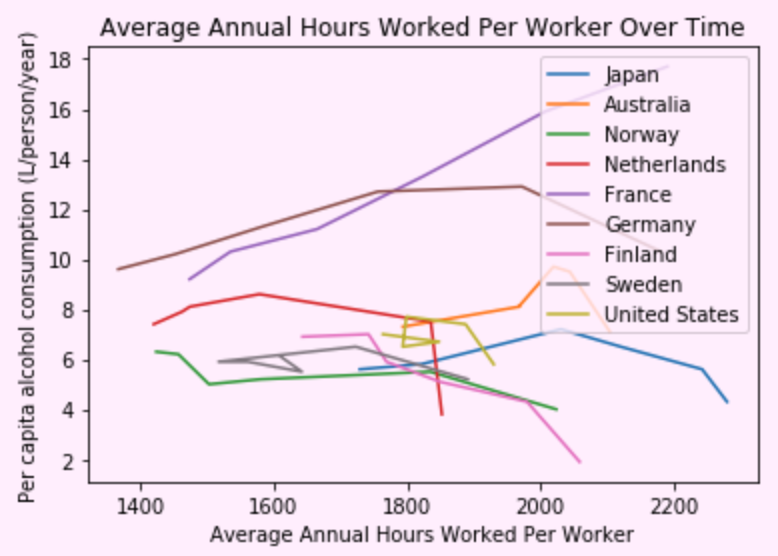

### Problem this analysis is trying to solve:
1. How do the average annual amount of hours worked per person vary across countries?
1. Are the amount of hours worked per person in a country correlated to the country's GDP? If so, what is the average amount of hours worked per person in the countries with the highest and lowest GDP's?
1. Are the amount of hours worked per person in a country correlated to the amount of alochol consumed per person? If so, what is the average amount of hours worked per person in the countries with the highest and lowest alcohol consumption?

### How to run the code:
1. Download and save the all the files in the repository to a folder on your computer.
1. Open your terminal.
1. cd into the folder you saved the files in.
1. Run the command "jupyter notebook". This will open the folder in the Jupyter Notebook website.
1. Open up the file "Hour Worked vs. GDP & Alcohol Consump..ipynb" on Jupyter Notebook.
1. At the top, under the "Kernal" tab, click "Restart & Run All". This will run all the cells on the page and display all the dataframes and graphs.

### Data collected:

### Why the data is displayed this way:
Line graphs were used to display the hours worked of each country, the GDP of each country, and the alcohol consumption of each country because they were showing change over several years. A line graph was also used to display hours worked vs. alcohol consumption because it clearly showed how some nations have increased/decreased their alcohol consumption as their annual working hours changed. Lastly, a scatter plot was used to display hours worked vs. GDP so that a possible relationship could be determined between the two variables.
